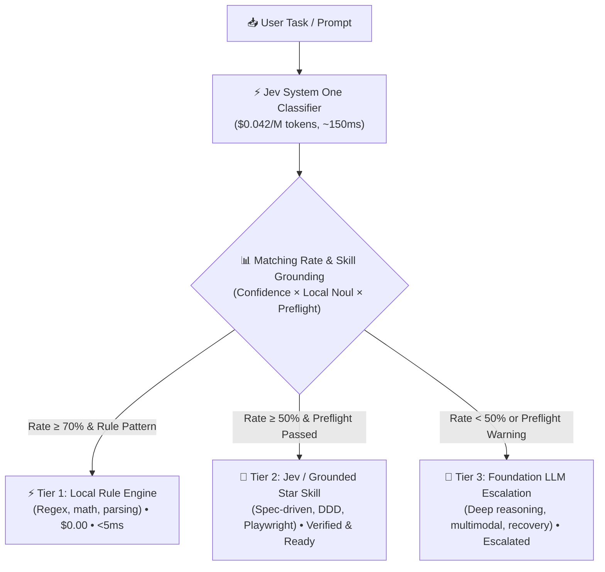

<div align="center">

# ⚡ To do - Jev

**Ultra-fast, low-cost intelligent task classifier & 3-tier routing engine powered by TypeSafe Jev (System One) and 20 Verified Canonical Agent Skill Profiles with Pre-flight Guarantees.**

[](https://opensource.org/licenses/MIT)
[](https://www.python.org/)
[-purple.svg)](https://docs.typesafe.ai)
[](#-3-tier-routing-architecture)
[](#-grounded-skill-guarantees--pre-flight-checks)

*Stop wasting $5/M tokens and 2,000ms using frontier LLMs for simple classification, deterministic routing, and ungrounded skill execution.*

</div>

---

## 🎯 Why To do - Jev?

In modern AI agent systems, **up to 70-80% of incoming tasks do not require a massive frontier model** (Gemini 2.5 Pro, Claude 3.7 Sonnet, GPT-5). Furthermore, blindly invoking agent skills without validating runtime environments causes silent failures and hallucinated results.

**To do - Jev** solves both problems:
1. **System One Routing**: Places **TypeSafe Jev** ($0.042/M tokens, $0 output, ~150ms) as a lightweight gatekeeper calculating a calibrated **Matching Rate** across 3 tiers.
2. **Grounded Skill Guarantees**: Decouples and verifies **20 Canonical Top Star Skill Profiles**, pairing each with **deterministic pre-flight checks** and **veto constraints** before execution.

---

## 🏗️ 3-Tier Routing Architecture



---

## ⭐ Grounded Skill Guarantees & Pre-flight Checks

A description in `SKILL.md` is merely a claim; **real suitability requires machine-verifiable proof**. `todo-jev` enforces 4 guarantee layers:

1. **Pre-flight Checks**: Machine checks before dispatch (Git repo detection, Node/npm runtime, Python test harness, dependency manifests).
2. **Negative Constraints (Veto Rules)**: Hard exclusions (e.g., rejecting architecture skills on 1-line typo fixes).
3. **Separation of Concerns**: Author != Verifier (`the-judge` model).
4. **Graceful Escalation**: If preflight fails, Jev automatically downgrades to Tier 3 LLM with a clear diagnosis instead of failing at runtime.

### 20 Verified Canonical Skill Profiles (`data/canonical_skill_profiles.json`)

All 20 profiles are cryptographically linked (SHA256 verified) to actual installed skills:

| Skill ID | Domain | Pre-flight Check | Key Deliverable |
|---|---|---|---|
| `tlc-spec-driven` | Planning & Architecture | Git repo present | EARS specification, atomic tasks, verification gates |
| `tactical-ddd` | Architecture & Refactoring | Git repo present | Bounded Context analysis, Dependency Inversion |
| `playwright-skill` | Testing & Web Automation | Node.js / npm environment | Headless browser scripts, UI regression snapshots |
| `security-best-practices` | Security & Compliance | Dependency manifests | SAST vulnerability audit, OWASP Top 10 remediation |
| `figma-implement-design` | Frontend & Design | Frontend UI workspace | Pixel-perfect React/Tailwind component generation |
| `the-judge` | Quality & Verification | Python test runner (pytest) | Adversarial PR review, independent rubric evaluation |
| `gh-fix-ci` | DevOps & Tooling | Git repository | CI/CD failure log parsing, local repro scripts, auto-patches |
| `core-web-vitals` | Web Performance | Frontend project | LCP, INP, CLS metric diagnosis & asset optimization |
| `create-adr` | Architecture & Docs | Git repository | Architecture Decision Records (Context, Decision, Consequences) |
| `create-rfc` | Architecture & Planning | Git repository | Request For Comments proposal specification |
| `coupling-analysis` | Architecture & Quality | Git repository | Afferent/Efferent coupling & circular dependency detection |
| `security-threat-model` | Security & Risk | Git repository | STRIDE threat modeling & data flow diagram review |
| `nestjs-modular-monolith` | Backend & Architecture | Node.js environment | NestJS modular monolith boundaries & CQRS |
| `react-best-practices` | Frontend & React | Frontend project | React 19 rules, hook misuse prevention & render optimization |
| `react-native-expert` | Mobile Development | Node.js environment | Expo Router navigation, cross-platform permissions |
| `perf-lighthouse` | Performance & CI | Node.js / lighthouse | Automated a11y, SEO, and performance audit reports |
| `sentry` | Observability & DevOps | Dependency manifests | Runtime exception tracking & issue triage |
| `cloudflare-deploy` | Cloud & Edge | Node.js / wrangler | Cloudflare Workers, Pages, D1 edge deployment |
| `spec-driven-eval` | Evaluation & Testing | Python test runner | Spec-driven benchmark harness & regression testing |
| `legacy-migration-planner` | Architecture & Modernization | Git repository | Strangler Fig modernization roadmap & rollback planning |

---

## 📊 Live Evaluation Benchmark (60 Unseen Prompts)

Evaluated on **60 unseen Korean prompts** using the live TypeSafe Jev System One API (`https://api.typesafe.ai/v1/systemone`):

| Metric | Baseline Mode (Simple Description) | Profile Mode (Grounded Knowledge Base) | Delta |
|---|---|---|---|
| **Overall Accuracy** | **91.7%** (55/60) | **93.3%** (56/60) | **+1.7%** |
| **Positive Skill Matching** | **100.0%** (20/20) | **100.0%** (20/20) | **0.0%** (Perfect) |
| **Negative Veto Accuracy** | **66.7%** (10/15) | **73.3%** (11/15) | **+6.6%** (Improved) |
| **Average Latency** | 1,047.9 ms | 1,047.7 ms | ~0.0 ms |

> 💡 **Key Finding:** Adding structured application conditions and negative veto constraints improved false positive resistance by **+6.6%** without incurring any measurable latency penalty.

---

## 🚀 Quick Start

### 1. Installation

```bash
git clone https://github.com/maker-KK/todo-jev.git
cd todo-jev
pip install -r requirements.txt
```

### 2. Configure Environment

Copy `.env.example` to `.env` and insert your TypeSafe API key (optional for offline heuristic mode):

```bash
cp .env.example .env
```

```env
TYPESAFE_API_KEY=your_typesafe_api_key_here
REPORT_FORMAT=one_line
RULE_THRESHOLD=0.70
JEV_THRESHOLD=0.50
AUTO_SYNC_SKILLS=true
```

### 3. CLI Commands

```bash
# 1. Default clean one-line routing
python -m app.cli route "신규 결제 기능 EARS 기획서 작성하고 태스크 분할해줘"

# 2. Detailed routing table with preflight verification
python -m app.cli route "신규 결제 기능 기획서 작성해줘" --format detailed

# 3. Inspect all 20 curated canonical skill profiles
python -m app.cli catalog

# 4. List discovered local agent skills
python -m app.cli skills

# 5. Run live comparative evaluation benchmark
python scripts/run_eval_comparison.py
```

---

## 🧪 Testing

Run all unit tests with pytest:

```bash
pytest
```

---

## 📄 License

MIT License © 2026 [maker-KK](https://github.com/maker-KK)
