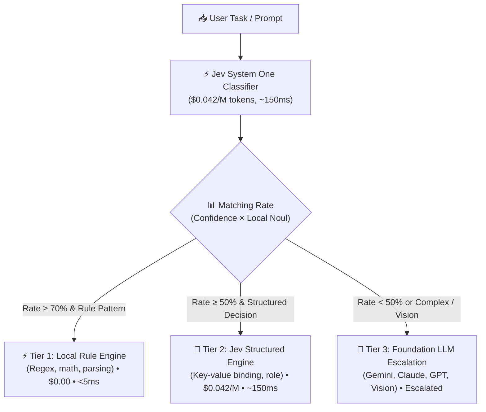

<div align="center">

# ⚡ To do - Jev

**Ultra-fast, low-cost intelligent task classifier and 3-tier routing engine powered by TypeSafe Jev (System One)**

[](https://opensource.org/licenses/MIT)
[](https://www.python.org/)
[-purple.svg)](https://docs.typesafe.ai)
[](#-3-tier-routing-architecture)

*Stop wasting $5/M tokens and 2,000ms using frontier LLMs for simple classification and deterministic routing.*

</div>

---

## 🎯 Why To do - Jev?

In modern AI agent systems, **up to 70-80% of incoming tasks do not require a massive frontier model** (Gemini 2.5 Pro, Claude 3.7 Sonnet, GPT-5). Yet most frameworks send every query straight to these heavy models, generating:
- 💸 **Excessive token costs** ($1.00 ~ $5.00+ per million tokens)
- ⏳ **High latency** (1,500ms ~ 3,000ms per turn)
- 🎭 **Hallucinations** on simple structural and pattern-matching decisions

**To do - Jev** flips this paradigm by placing **TypeSafe Jev (System One)** as an ultra-fast, ultra-low-cost ($0.042/M tokens, $0 output) gatekeeper. Jev computes a mathematically **Calibrated Matching Rate** to direct each task to the most efficient tier.

---

## 🏗️ 3-Tier Routing Architecture



---

## 📊 Cost & Latency Benchmark

| Execution Tier | Handled Tasks | Typical Cost | Latency | Example Use Case |
|---|---|---|---|---|
| **Tier 1: Local Rule** | ~35% | **$0.000** | **< 5 ms** | Unit conversions, regex parsing, arithmetic formulas |
| **Tier 2: Jev System One** | ~40% | **$0.00004** | **~150 ms** | Answer sheet-to-problem binding, role categorization |
| **Tier 3: Foundation LLM** | ~25% | $0.003 ~ $0.02 | ~2,000 ms | Complex coding, creative essay writing, image analysis |

> 💡 **Result:** Overall agent workflow operating costs drop by **up to 88%** with a **5x throughput boost**.

---

## 🚀 Quick Start

### 1. Installation

```bash
git clone https://github.com/maker-KK/todo-jev.git
cd todo-jev
pip install -r requirements.txt
```

### 2. Configure Environment

Copy `.env.example` to `.env` and insert your TypeSafe API key:

```bash
cp .env.example .env
```

```env
TYPESAFE_API_KEY=your_typesafe_api_key_here
```

### 3. Run Interactive CLI

Classify and route any prompt directly:

```bash
python -m app.cli route "15 + 27 수식 계산하고 cm 단위로 변환해줘"
```

Run the built-in benchmark demo suite:

```bash
python -m app.cli demo
```

---

## 💻 Python SDK Usage

```python
import asyncio
from app.router import TaskRouter

async def main():
    router = TaskRouter()
    
    # 1. Deterministic task
    result = await router.route_and_execute("PDF 0페이지의 3번 문항 정답과 쪽수 앵커 연결해줘")
    print("Recommended Tier:", result["cost_tier"])
    print("Matching Rate:", result["classification"]["matching_rate"])
    print("Latency:", result["latency_ms"]["total"], "ms")

asyncio.run(main())
```

---

## 🧪 Testing

Run unit tests with pytest:

```bash
pytest
```

---

## 📄 License

MIT License © 2026 [maker-KK](https://github.com/maker-KK)
