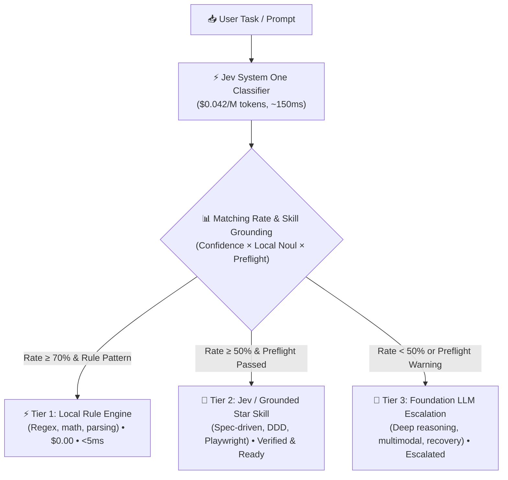

<div align="center">

# ⚡ To do - Jev

**Ultra-fast, low-cost intelligent task classifier & 3-tier routing engine powered by TypeSafe Jev (System One) and Curated Top Star Agent Skills with Pre-flight Guarantees.**

[](https://opensource.org/licenses/MIT)
[](https://www.python.org/)
[-purple.svg)](https://docs.typesafe.ai)
[](#-3-tier-routing-architecture)
[](#-grounded-skill-guarantees--pre-flight-checks)

*Stop wasting $5/M tokens and 2,000ms using frontier LLMs for simple classification, deterministic routing, and ungrounded skill execution.*

</div>

---

## 🎯 Why To do - Jev?

In modern AI agent systems, **up to 70-80% of incoming tasks do not require a massive frontier model** (Gemini 2.5 Pro, Claude 3.7 Sonnet, GPT-5). Furthermore, blindly invoking agent skills without validating runtime environments causes silent failures and hallucinated results.

**To do - Jev** solves both problems:
1. **System One Routing**: Places **TypeSafe Jev** ($0.042/M tokens, $0 output, ~150ms) as a lightweight gatekeeper calculating a calibrated **Matching Rate** across 3 tiers.
2. **Grounded Skill Guarantees**: Curates top star agent skills from the GitHub ecosystem, pairing each with **deterministic pre-flight checks** and **veto constraints** before execution.

---

## 🏗️ 3-Tier Routing Architecture



---

## ⭐ Grounded Skill Guarantees & Pre-flight Checks

A description in `SKILL.md` is merely a claim; **real suitability requires machine-verifiable proof**. `todo-jev` enforces 4 guarantee layers:

1. **Pre-flight Checks**: Machine checks before dispatch (Git repo detection, Node/npm runtime, Python test harness, dependency manifests).
2. **Negative Constraints (Veto Rules)**: Hard exclusions (e.g., rejecting architecture skills on 1-line typo fixes).
3. **Separation of Concerns**: Author != Verifier (`the-judge` model).
4. **Graceful Escalation**: If preflight fails, Jev automatically downgrades to Tier 3 LLM with a clear diagnosis instead of failing at runtime.

### Curated Top Star Skill Profiles

| Skill ID | Domain | Pre-flight Check | Typical Action & Deliverable |
|---|---|---|---|
| `tlc-spec-driven` | Planning & Architecture | Git repo present | EARS specification, atomic task breakdown, verification gates |
| `tactical-ddd` | Architecture & Refactoring | Git repo present | Bounded Context analysis, Dependency Inversion diagrams |
| `playwright-skill` | Testing & Web Automation | Node.js / npm environment | Headless browser scripts, UI regression snapshots |
| `security-best-practices` | Security & Compliance | Dependency manifests | SAST vulnerability audit, OWASP Top 10 remediation |
| `figma-implement-design` | Frontend & Design | Frontend UI workspace | Pixel-perfect React/Tailwind component generation |
| `the-judge` | Quality & Verification | Python test runner (pytest) | Adversarial PR review, independent rubric evaluation |
| `gh-fix-ci` | DevOps & Tooling | Git repository | CI/CD failure log parsing, local repro scripts, auto-patches |

---

## 📊 Cost & Latency Benchmark

| Execution Tier | Handled Tasks | Typical Cost | Latency | Example Use Case |
|---|---|---|---|---|
| **Tier 1: Local Rule** | ~35% | **$0.000** | **< 5 ms** | Unit conversions, regex parsing, arithmetic formulas |
| **Tier 2: Jev / Star Skill** | ~40% | **$0.00004** | **~150 ms** | Answer sheet-to-problem binding, verified EARS planning |
| **Tier 3: Foundation LLM** | ~25% | $0.003 ~ $0.02 | ~2,000 ms | Complex novel coding, creative essay writing, image analysis |

> 💡 **Result:** Overall agent workflow operating costs drop by **up to 88%** with a **5x throughput boost**.

---

## 🚀 Quick Start

### 1. Installation

```bash
git clone https://github.com/maker-KK/todo-jev.git
cd todo-jev
pip install -r requirements.txt
```

### 2. Configure Environment

Copy `.env.example` to `.env` and insert your TypeSafe API key (optional for offline heuristic mode):

```bash
cp .env.example .env
```

```env
TYPESAFE_API_KEY=your_typesafe_api_key_here
REPORT_FORMAT=one_line
RULE_THRESHOLD=0.70
JEV_THRESHOLD=0.50
AUTO_SYNC_SKILLS=true
```

### 3. CLI Commands

#### ⚡ Classify and Route a Task
```bash
# Default clean one-line report
python -m app.cli route "신규 결제 기능 EARS 기획서 작성하고 태스크 분할해줘"

# Detailed verdict table with preflight diagnostics
python -m app.cli route "신규 결제 기능 기획서 작성해줘" --format detailed

# Override threshold and toggle auto-sync
python -m app.cli route "15 + 27 수식 계산해줘" --threshold 0.85 --no-auto-sync
```

#### ⭐ Inspect Curated Star Skill Catalog
```bash
python -m app.cli catalog
```

#### 📦 List Discovered Local Agent Skills
```bash
python -m app.cli skills
```

#### 🚀 Run Built-in Benchmark Demo
```bash
python -m app.cli demo
```

---

## 💻 Python SDK Usage

```python
import asyncio
from app.router import TaskRouter

async def main():
    router = TaskRouter()
    
    # 1. Classified with Star Skill matching & Preflight Guarantee
    result = await router.route_and_execute("신규 결제 기능 EARS 기획서 작성하고 태스크 분할해줘")
    
    clf = result["classification"]
    print("Recommended Tier:", clf["recommended_tier"])
    print("Matched Skill:", clf.get("matched_skill"))
    print("Preflight Status:", clf.get("preflight_details"))
    print("Guarantee Badge:", clf.get("guarantee_badge"))
    print("Matching Rate:", f"{clf['matching_rate']:.1%}")

asyncio.run(main())
```

---

## 🧪 Testing

Run all unit tests with pytest:

```bash
pytest
```

---

## 📄 License

MIT License © 2026 [maker-KK](https://github.com/maker-KK)
