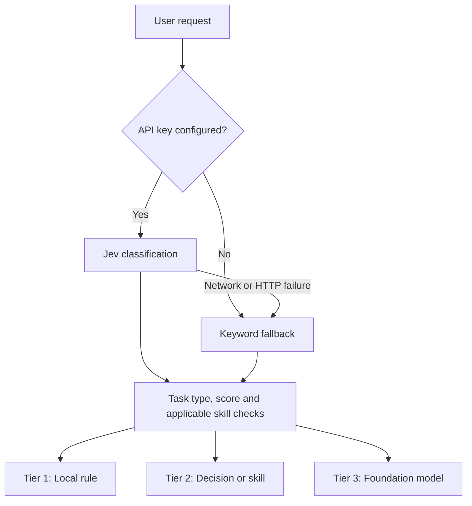

<div align="center">

# ⚡ todo-jev

**Choose the next step before your AI agent takes it.**

A task-routing experiment powered by TypeSafe Jev, structured skill profiles, and basic environment checks.

[](pyproject.toml)
[](LICENSE)
[](https://docs.typesafe.ai)

[Quick start](#quick-start) · [How it works](#how-it-works) · [Skill profiles](#skill-profiles) · [Evaluation](#evaluation)

</div>

**todo-jev** classifies a request and recommends a handling path: a local rule, a structured decision or specialist skill, or a foundation model. It combines **when a skill applies and when to exclude it** with basic environment checks performed locally.

> **한국어 소개:** 사용자의 요청을 분석해 처리 경로와 적합한 스킬을 추천하는 실험용 라우터입니다. 스킬의 적용·제외 조건과 기본 실행 환경을 함께 살펴봅니다.

**Current scope:** Classification, skill matching, and routing decisions are implemented. The execution handlers return example responses; performing the selected task requires connecting your own rule functions, skill runner, or model client.

## Why todo-jev?

An agent may have dozens of skills available, each with different strengths and prerequisites. Choosing a useful next step depends on both the request and the available environment.

This project explores whether giving Jev structured selection criteria can improve that choice:

- **Three routing tiers** for local rules, focused decisions or skills, and foundation-model work.
- **20 bundled skill profiles** with application conditions, exclusions, and source metadata.
- **Basic preflight checks** that report environment evidence and influence skill routing.
- **Local skill discovery** to include additional installed skill descriptions in live classification.
- **An offline fallback** for trying the CLI without an API key.

## Quick start

Requires **Python 3.10+** and Git. Run the examples from the repository root; environment checks inspect your current working directory.

### 1. Install

```bash
git clone https://github.com/maker-KK/todo-jev.git
cd todo-jev
python -m venv .venv
```

Activate the virtual environment:

```bash
# macOS / Linux
source .venv/bin/activate
```

```powershell
# Windows PowerShell
.venv\Scripts\Activate.ps1
```

Then install the dependencies:

```bash
python -m pip install -r requirements.txt
```

Use `python3` if that is the Python command on your system.

### 2. Try offline routing

Leave `TYPESAFE_API_KEY` unset or empty in both `.env` and your shell to use the keyword-based fallback:

```bash
python -m app.cli route "15 + 27 계산해줘"
python -m app.cli route "PDF 정답지와 문항 번호를 매칭해줘"
python -m app.cli route "사진 속 도형을 분석해줘"
```

These examples produce the following routing recommendations in offline mode:

| Request | Recommended path |
|---|---|
| Calculate `15 + 27` | Tier 1 — local rule |
| Match answer-sheet entries to question numbers | Tier 2 — structured decision |
| Interpret a shape in a photo | Tier 3 — foundation model |

Inspect a bundled skill and its environment check:

```bash
python -m app.cli route "tlc-spec-driven: 신규 기능의 요구사항을 정리해줘" --format detailed
python -m app.cli catalog
```

Offline matching uses literal keywords and profile text. Including a skill ID makes it easier to try a specific profile.

### 3. Enable Jev

Create a `.env` file in the repository root with your TypeSafe API key:

```dotenv
TYPESAFE_API_KEY=your_typesafe_api_key_here
```

Run the same commands to classify through Jev. The client uses `jev-latest` at `https://api.typesafe.ai/v1/systemone`. Network errors and unsuccessful HTTP responses fall back to the local heuristic.

## CLI reference

| Command | Purpose |
|---|---|
| `python -m app.cli route "<prompt>"` | Show a one-line routing decision and rationale |
| `python -m app.cli route "<prompt>" --format detailed` | Show task type, score, matched skill, and available preflight details |
| `python -m app.cli route "<prompt>" --format quiet` | Run without terminal output |
| `python -m app.cli route "<prompt>" --threshold 0.80` | Override the live local-rule threshold |
| `python -m app.cli route "<prompt>" --no-auto-sync` | Exclude discovered local skills from live criteria |
| `python -m app.cli catalog` | Inspect the 20 bundled profiles and their basic environment checks |
| `python -m app.cli skills` | List discovered local skills, showing up to 20 entries |
| `python -m app.cli demo` | Run a short set of example requests |
| `python -m app.cli --help` | Show available commands |

### Configuration

Set these variables in `.env` or your shell:

| Variable | Default | Purpose |
|---|---|---|
| `TYPESAFE_API_KEY` | Unset | Enable live Jev classification |
| `JEV_REPORT_FORMAT` | `one_line` | `one_line`, `detailed`, or `quiet` |
| `JEV_RULE_THRESHOLD` | `0.70` | Minimum live score for a general deterministic-rule task to use Tier 1 |
| `JEV_THRESHOLD` | `0.50` | Minimum live score for a general structured-decision task to use Tier 2 |
| `JEV_AUTO_SYNC_SKILLS` | `true` | Include discovered skill descriptions in live classification criteria |

Thresholds apply to the general task categories in live mode. Skill matches follow the checks below; offline mode uses fixed heuristic scores and routing rules.

## How it works



In live mode, Jev returns a task choice and a local-suitability score. The classifier calculates:

```text
matching_rate = task_type_confidence × can_handle_locally
```

This is a routing score. Treat it as a decision aid; it has not been calibrated as a probability of successful execution.

| Classification | Routing behavior in live mode |
|---|---|
| General deterministic-rule task | Tier 1 when the score meets `JEV_RULE_THRESHOLD`; otherwise Tier 3 |
| General structured-decision task | Tier 2 when the score meets `JEV_THRESHOLD`; otherwise Tier 3 |
| Bundled skill profile | Tier 2 when its preflight check passes and no literal exclusion matches; otherwise Tier 3 |
| Discovered skill without a bundled profile | Tier 2 recommendation, without a profile-specific preflight check |
| Vision, complex reasoning, or unknown task | Tier 3 |

Preflight affects the selected tier, separately from the live score. Live classification calls Jev before choosing a tier, including for tasks ultimately assigned to Tier 1.

## Skill profiles

The [canonical profile catalog](data/canonical_skill_profiles.json) contains 20 curated profiles. Each records application and exclusion conditions, expected inputs, preparation notes, a preflight contract, and source metadata.

Profile mode sends the first two application conditions and first two exclusions per profile to Jev. After a bundled skill is selected, the classifier also checks for literal exclusion-text matches in the request.

<details>
<summary>Browse all 20 bundled profiles</summary>

| Skill ID | Focus | Basic check |
|---|---|---|
| `tlc-spec-driven` | Requirements and implementation planning | Git repository |
| `tactical-ddd` | Domain boundaries and refactoring | Git repository |
| `playwright-skill` | Browser automation and E2E testing | Node environment |
| `security-best-practices` | Security review | Dependency manifest |
| `figma-implement-design` | Design implementation | Frontend workspace markers |
| `the-judge` | Independent code review | Python test-harness markers |
| `gh-fix-ci` | CI failure investigation | Git repository |
| `core-web-vitals` | Web performance | Frontend workspace markers |
| `create-adr` | Architecture decision records | Git repository |
| `create-rfc` | Technical proposals | Git repository |
| `coupling-analysis` | Module dependencies and coupling | Git repository |
| `security-threat-model` | Threat modeling | Git repository |
| `nestjs-modular-monolith` | Backend architecture | Node environment |
| `react-best-practices` | React implementation | Frontend workspace markers |
| `react-native-expert` | Mobile development | Node environment |
| `perf-lighthouse` | Performance auditing | Node environment |
| `sentry` | Error investigation | Dependency manifest |
| `cloudflare-deploy` | Edge deployment | Node environment |
| `spec-driven-eval` | Evaluation and testing | Python test-harness markers |
| `legacy-migration-planner` | Modernization planning | Git repository |

</details>

**What the checks mean:** Each profile runs one broad presence check, such as finding a Git repository, manifest, or Node executable. The CLI badge `Verified & Ready` means that check passed. Actual skill installation, tool availability, credentials, and output quality need validation by the execution layer. Recorded SHA256 fingerprints are metadata; identity verification is not enforced during routing.

### Add local skills

The registry scans one level of `*/SKILL.md` files under these default locations:

- `.agent/skills/`
- `../cjbs-backend/.agent/skills/`
- `~/.gemini/antigravity/skills/`

With auto-sync enabled, live criteria consider up to the first 15 discovered skills, using their names and shortened descriptions. Bundled profiles take precedence when names overlap. You can supply different directories through `SkillRegistry(search_paths=[...])` in Python.

## Use from Python

Access the structured classification result to integrate a routing decision into your own agent:

```python
import asyncio
from app.classifier import JevClassifier

async def main():
    decision = await JevClassifier().classify("PDF 정답지와 문항 번호를 매칭해줘")
    print(decision.model_dump_json(indent=2))

asyncio.run(main())
```

The result includes `task_type`, `matched_skill`, `matching_rate`, `recommended_tier`, `preflight_details`, and `rationale`. The example handlers in [app/router.py](app/router.py) show where to connect downstream execution.

For the separate Aside agent integration, see [aside/README.md](aside/README.md).

## Evaluation

The [committed report](data/eval_comparison_report.json), dated **September 18, 2026**, compares description-based criteria with profile-based criteria on **60 Korean prompts marked `eval`** in the [80-prompt dataset](data/benchmark_80.json).

| Metric | Description-based baseline | Profile-based criteria |
|---|---:|---:|
| Overall evaluator pass rate | 55/60 · **91.7%** | 56/60 · **93.3%** |
| Positive skill-and-tier matches | 20/20 · 100.0% | 20/20 · 100.0% |
| Negative-case pass rate | 10/15 · 66.7% | 11/15 · 73.3% |
| Mean classification latency | 1,047.9 ms | 1,047.7 ms |

Profile mode passed **one additional case** overall: **+1.7 percentage points** across all 60 cases and **+6.7 percentage points** across the 15 negative cases.

Read these results using the [evaluator's scoring rules](scripts/run_eval_comparison.py): a negative case passes if no skill is selected, a veto is reported, **or** the expected tier is selected. That is a broader criterion than requiring an exact routing match. This is one saved run; assessing general accuracy or latency improvements requires further evaluation. The report records no per-call live/fallback status.

To run your own comparison with a configured TypeSafe key:

```bash
python scripts/run_eval_comparison.py
```

The script evaluates both modes, attempts 120 classifications, and overwrites `data/eval_comparison_report.json`. Without a key, it uses the offline fallback.

## Development and contributing

Ensure `TYPESAFE_API_KEY` is absent or empty in both `.env` and your shell, then run the existing tests from the repository root:

```bash
python -m pytest
```

The canonical-identity test currently requires a separately installed `tlc-spec-driven` skill matching the recorded fingerprint. A fresh clone without that skill fails that test.

Useful contributions include reproducible routing mistakes, more varied evaluation prompts, stronger prerequisite checks, and execution adapters. When reporting a routing issue, include the prompt, expected path, actual decision, live/offline mode, and relevant environment details.

Open an [issue](https://github.com/maker-KK/todo-jev/issues) or submit a [pull request](https://github.com/maker-KK/todo-jev/pulls).

## License

[MIT](LICENSE) © 2026 [maker-KK](https://github.com/maker-KK)
